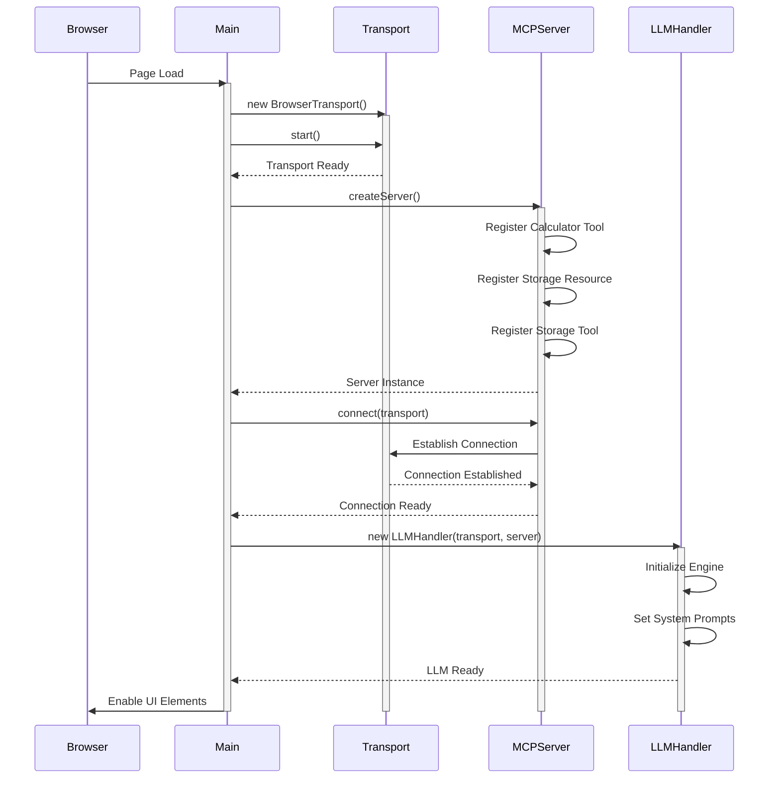
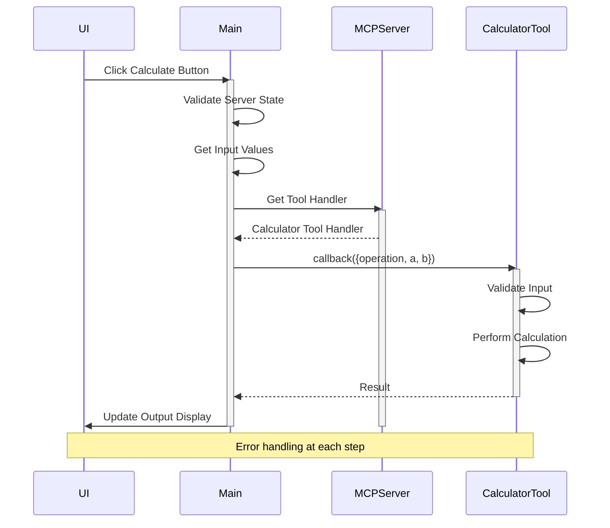
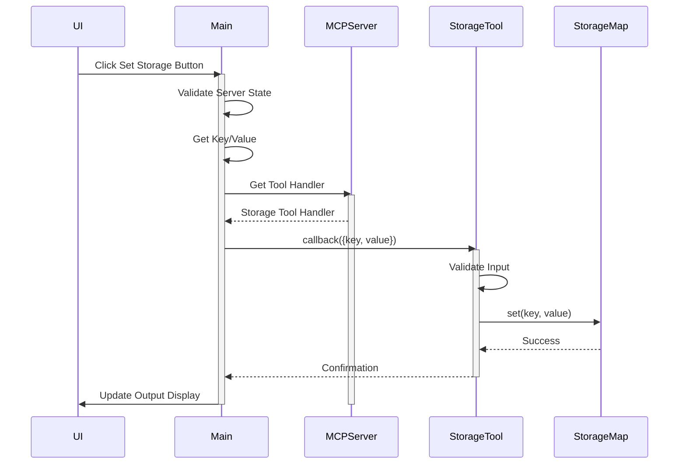
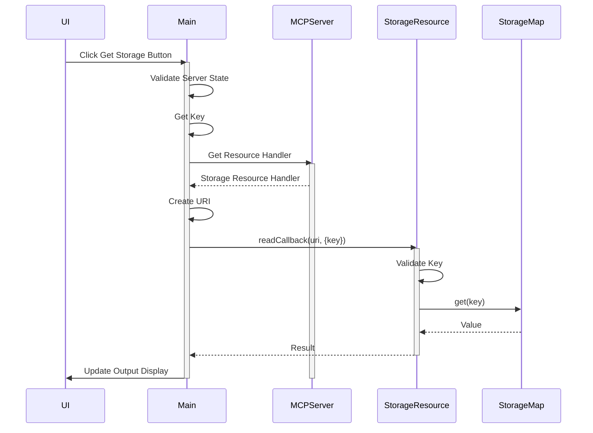
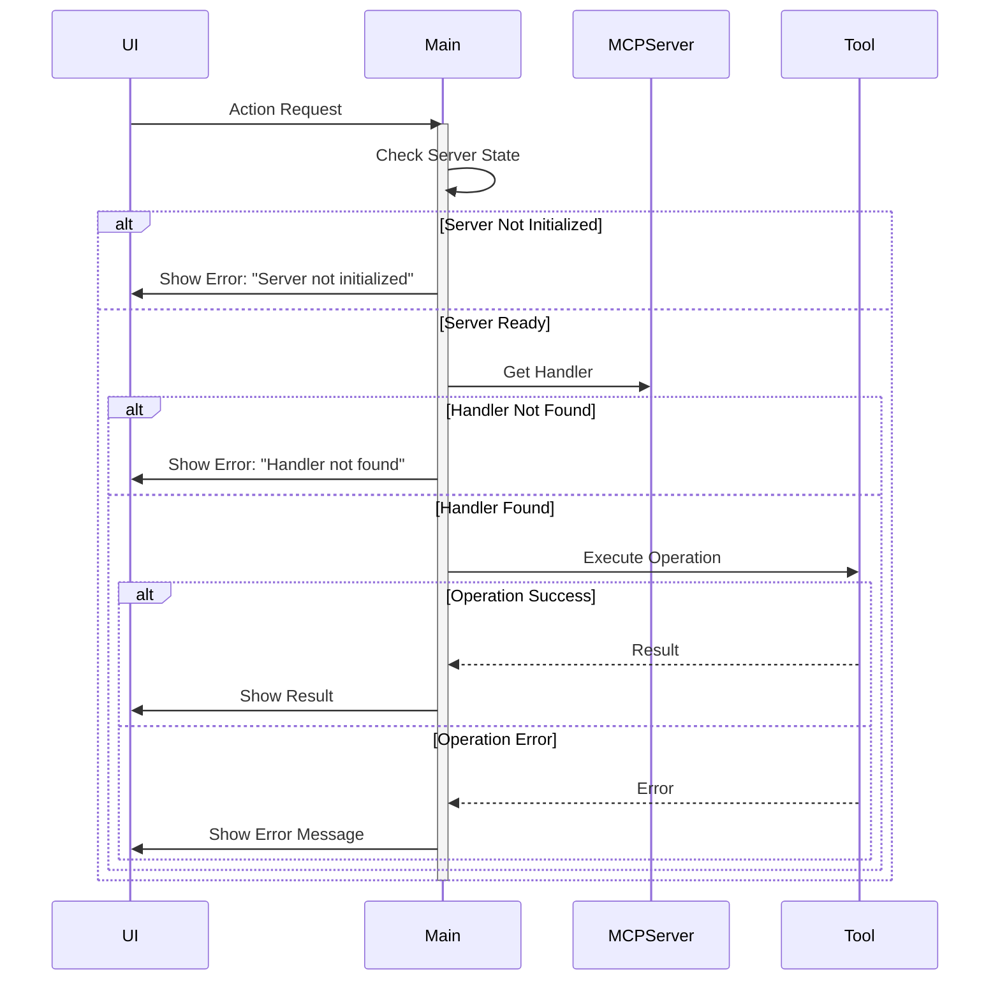
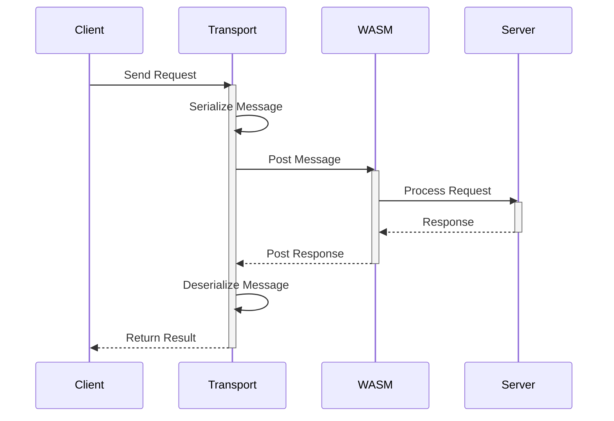
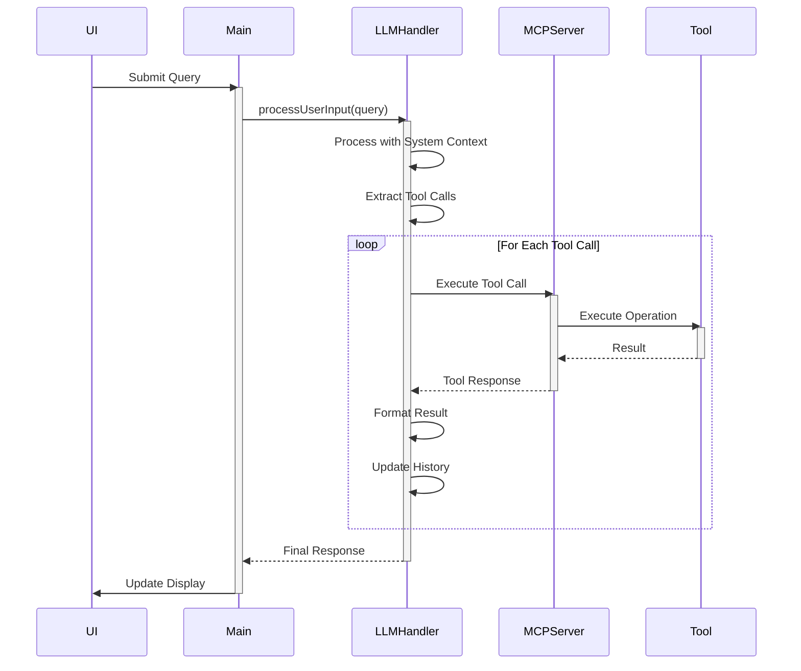
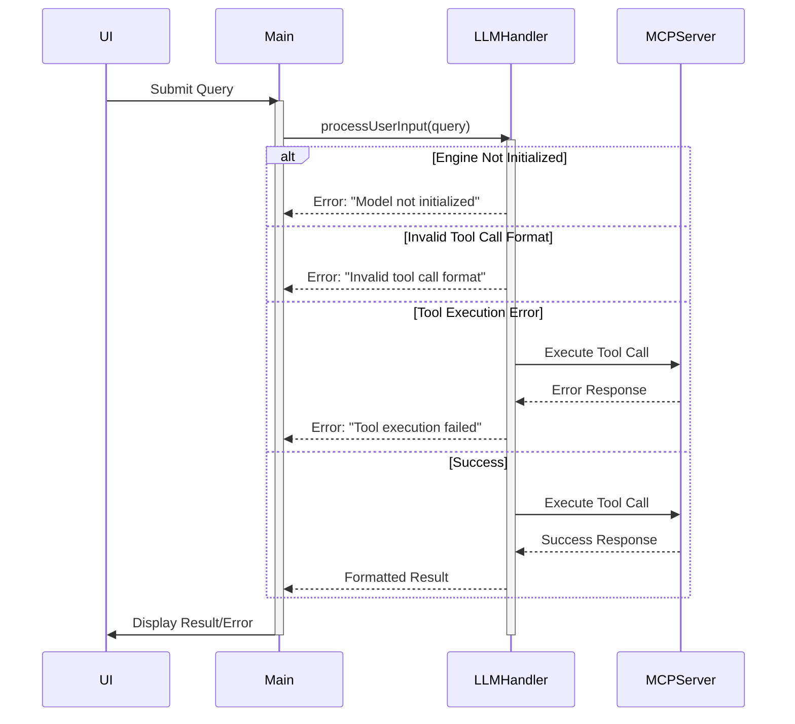

# WASM MCP Server Sequence Diagrams

This document illustrates the message flows between different components of the WASM MCP Server using sequence diagrams.

## Server Initialization Flow

## Calculator Operation Flow

## Storage Set Operation Flow

## Storage Get Operation Flow

## Error Handling Flow

## Transport Message Flow

## Natural Language Query Flow

## LLM Error Handling Flow

## Notes on the Diagrams

### Component Roles
- **Browser/UI**: Handles user interactions and display
- **Main**: Coordinates between UI and server components
- **Transport**: Manages message passing
- **MCPServer**: Core server functionality
- **Tools/Resources**: Specific implementations
- **LLMHandler**: Handles natural language processing

### Key Interactions
1. **Initialization**: One-time setup of server and transport
2. **Tool Operations**: Synchronous request-response
3. **Resource Access**: Template-based with parameters
4. **Error Handling**: At multiple levels
5. **Natural Language Query**: Asynchronous processing with system context

### Important Considerations
- All operations are asynchronous
- Error handling at each step
- State validation before operations
- Clear message flow paths
- Resource cleanup
